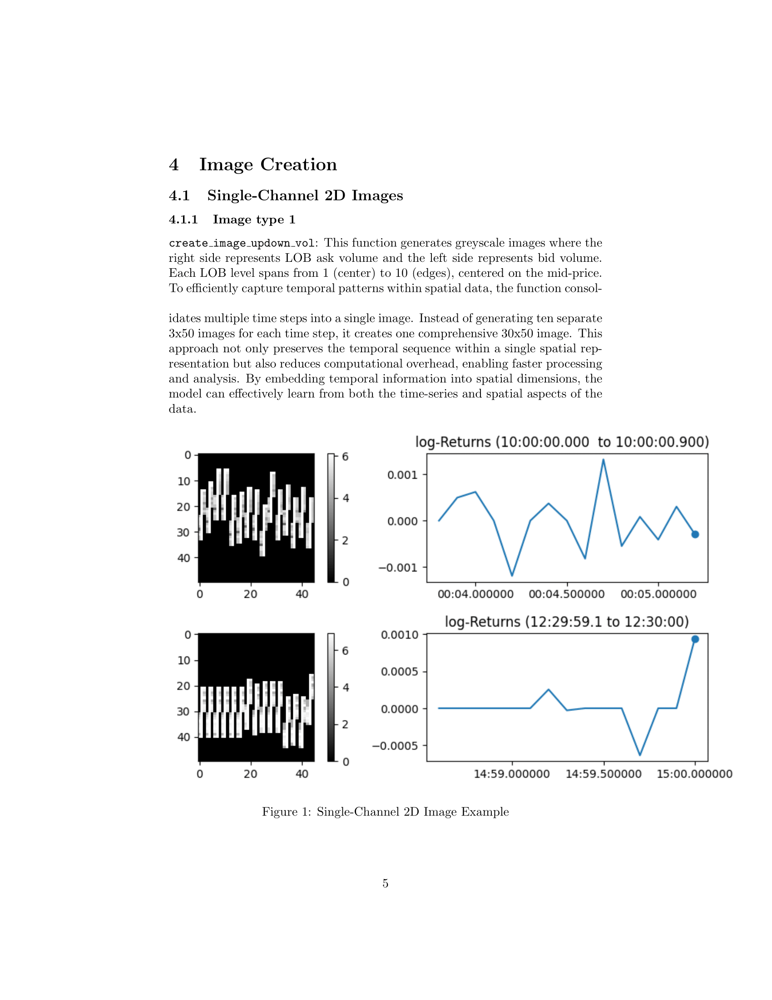
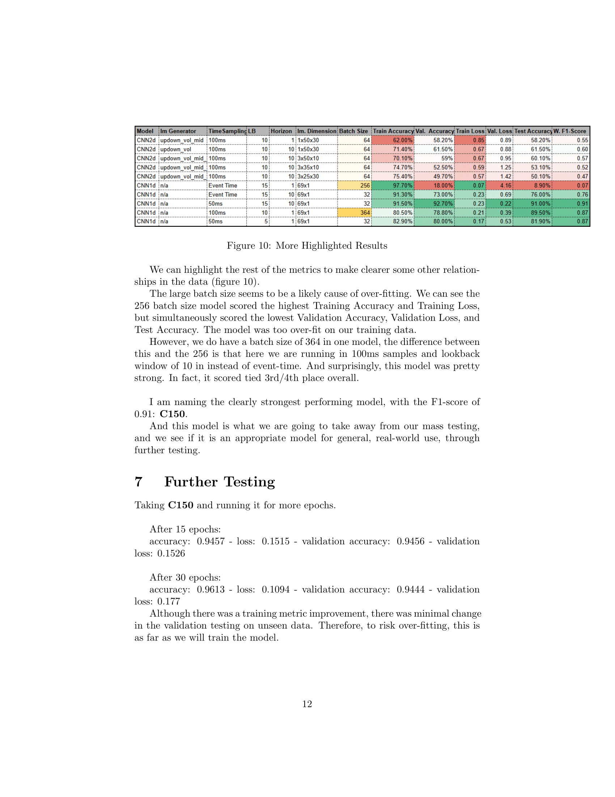

# Project Documentation

The dataset of stocks that were used for the processing are too large to be uploaded for the github.
So are the cleaned and processed datasets.

Contained in this repo is:

- /CNN_png, the folder to store the png's of the pdf visible below.
- /completedmodels, the folder to store some of the notebooks used for testing different model variations.
- /images, to store the images saved and used in the creation of the pdf.
- C150.h5 & C150.keras , the C150 CNN model in legacy and keras format.
- CNN.pdf, the original PDF of the images displayed below.
- CNNdataprep.ipynb, the processing and calculations for the channels of metric and target variables use in training process.
- CNNimagegen.ipynb, the notebook used for testing and visualsing the 2D Single & Triple channel images for CNN input & the processing function.
- distributions.ipny, notebook I used to generate some of the return distribution images.

Here is the download location for the PDF:
[PDFlocation](CNN_paper.pdf)

Here are the images from the documentation:

